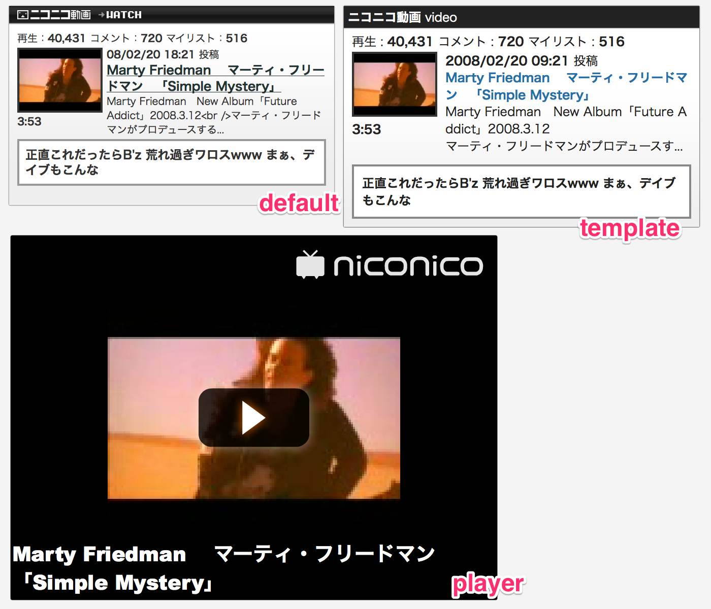

# WP-Nicodo

このソフトウェアは、記事にニコニコ動画を貼り付けるための WordPress プラグインです。

ニコニコ動画標準のブログパーツ方式、テンプレート ( 自作 HTML/CSS ) を使用したカスタム表示、ニコニコ外部プレーヤーに対応しています。

## 使い方

1. 投稿ページを表示します
2. ツールバーの nicodo ( テキスト ) またはニコニコテレビちゃん ( ビジュアル ) ボタンを押します
3. 記事にショートコードが挿入されます
4. ショートコードの間に動画の ID ( sm****** ) を指定します

プラグインの詳細については、以下のページに解説しています。

* [WP-Nicodo - アカベコマイリ](http://akabeko.me/blog/software/wp-nicodo/)

## スクリーンショット

## ライセンス

* [GNU GENERAL PUBLIC LICENSE Version 2](LICENSE.txt)

## 開発情報

開発に関する情報は Redmine で管理しています。

* [WP-Nicodo - Redmine](http://akabeko.me/projects/projects/wp-nicodo)
