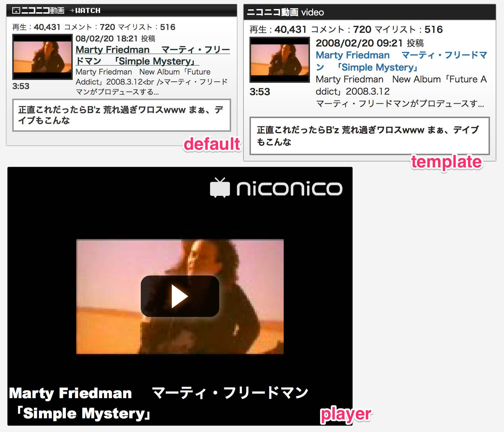

# WP-Nicodo

It is a WordPress plug-in that allows you to insert the content of Niconico ( http://www.nicovideo.jp/ ) to article.

## How to use

1. Show me the post page
2. Press the nicodo ( text mode ) or tv-chang ( visual mode ) button
3. Insert the WP-Nicodo shortcode
4. Write the vide ID ( sm****** ) between the short code

More information refer to the following pages.

* [WP-Nicodo - AKABEKOMAIRI](http://akabeko.me/blog/software/wp-nicodo/)

## Screenshots

## Licence

* [GNU GENERAL PUBLIC LICENSE Version 2](LICENSE.txt)

## Development

Managed by Redmine development information.

* [WP-Nicodo - Redmine](http://akabeko.me/projects/projects/wp-nicodo)
